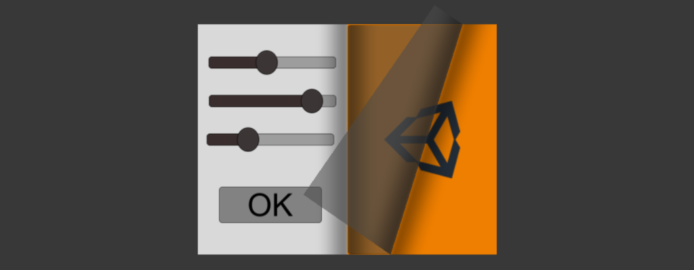
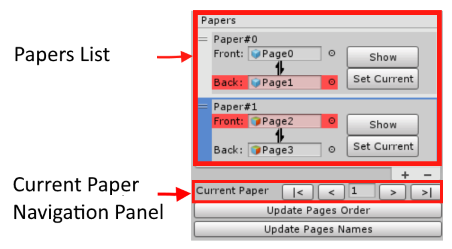
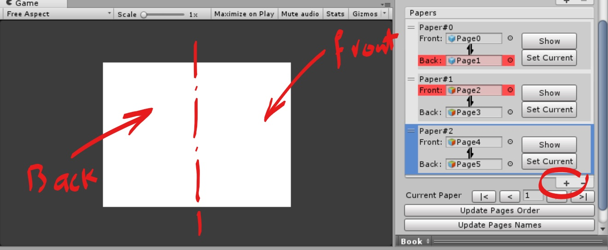
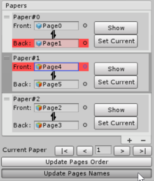
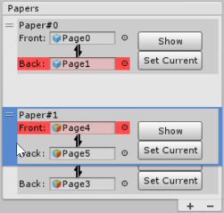
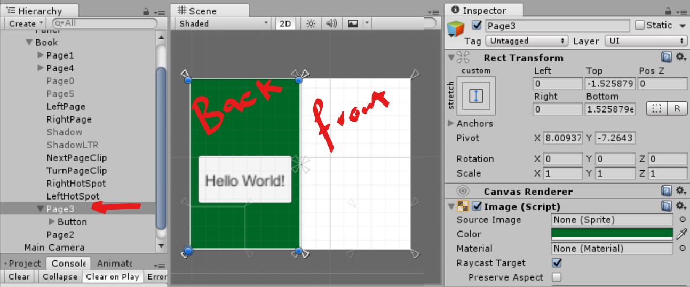
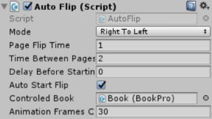
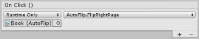

# Unity3D Book Page Curl - Pro 

**The "Unity3D Book Page Curl Pro" is a unity package that is used to create a book with page flip effect using unity3D native UI tools, with much more features than the free version.**

  

## **Getting Started**

_**Download the unity package from unity [Asset Store](	http://u3d.as/ECT).**_ 

## **Video tutorial**
_**Watch a the video version of this tutorial [here ](https://youtu.be/eAZ7aab8I4g).**_ 

### Create your first book:

   * Import the unity package
   * Create a canvas and EventSystem objects if you don't have one (the easiest way to create them is by adding any UI object then you can delete it).
   * Drag a book prefab under the Canvas element
   * Resize the book on your scene and reposition the anchors as required.
   * Select the book from hierarchy to show it in inspector.
   * Assign the canvas to the canvas slot in inspector

### What you need to know about your first book:

   * This book now contains only two papers each paper has front and back (two pages)
   * You can see all book papers by click on the book in hierarchy window to show the BookPro component in Inspec tor window, under the BookPro component in inspector window you can find a list of all book’s papers 
   * You can change the current shown paper (which will be the start paper when you run the scene) by pressing the next or previous buttons in the “Current Paper Navigation Panel”, or writing the current paper index if you know it, or just press “Set Current” button in the paper item inside the papers list
   * The index of current paper represent the paper that its front shown in the right part of the book, in other words if you want to show the very first page of the book (aka the front cover of the book), you need to set the current paper to 0, and if you need to show the very last page (aka the back cover of the book) you need to set the current paper to (last paper index +1).
   * The two pages shown always marked in inspector with the red color, the back page of previous paper always shown in the left and front page of current paper always shown in the right
   * To edit any paper pages you can press the show button in the paper section under the papers list, now the front page of the paper is shown in right part and the back page is shown in left part. NOTE : this is just a preview these two pages will be at the back of each other.
   * To return to the correct pages order just press the “Update Pages Order” or change the current paper index.

### Add/Delete/Modify papers:
   * To add new paper just press the + button under the list, the new paper will be added, its front page is shown in the right part of the book and the back page is shown in the left part (this is the same preview that you get when press on the show button).

   * To delete paper, select it on the papers list and press the (-) button.
   * To change papers orders just drag papers in papers list.
   * To rename pages automatically according to their order press on “Update Pages Names” button, then press OK.
   * To modify paper pages, make sure the pages is shown by press the show button to make the page editing easier
   * Navigate to the page that you need to modify in inspector (the two pages will be the last two children under the book) and select the page object in hierarchy to start editing
   * Each page has image component and mask component, don’t remove or edit the mask component. It is responsible for keeping all page’s contents inside the page.
   * You can select the image source for page image component or change its color.
   * You can add any UI element under the page (as child).
  
  
  
  
   * Keep in mind this is just a preview the two pages in left and right will represent one paper, they will be placed back-to-back
   * If you want to call any function when any page flipped add it to the OnFlip Event List.
   * If you want to resize the area that the user can drag the page from it, open the Book node in inspector to show its children, you will find two objects "RightHotSpot" and "LeftHotSpot" resize them and set their anchors as required.
   * RUN and enjoy the page curl effect!
   

  
### Create Automatic Flipping Book:

   
  
* After creating your book as mentioned above add an "Auto Flip" component on it.
* Choose flipping direction( if you choose left to right make sure that the current paper of the book component is equal to your papers count "last page index + 1").
* **Uncheck** the **interactable** check in the book component.
* Specify the page flipping time parameters(Page Flip Time, Time Between Pages(including flipping time), Delay before Start flipping, Number of Animation frames for each page flip).
* Check "Auto Start Flip" if you want the book to start flipping automatically, or uncheck it and call the `StartFlipping()` function in your code.

### Control Flipping Manually:

**This section will explore how to create a scene like the “Example_2” scene.**

* To be able to let the user control page flipping using some buttons, create your book, add an "Auto Flip" component on it and configured them as mentioned above.
* Uncheck the “interactable” of the book and "Auto Start Flip" of the “Auto Flip” components.
* Add previous and next buttons to your scene (check Example_2 scene if you have any issues setting them correctly). 
* Add a new slot on each button OnClick list by clicking the (+) sign,  assign the Book as the game object then select the “AutoFlip -> FlipRightPage” for the next button and “Auto Flip -> Flip Left Page” to the previous button.

  

* If you need to flip the page from code (based on a custom action) you can call the `FlipLeftPage()` or `FlipRightPage()`.
